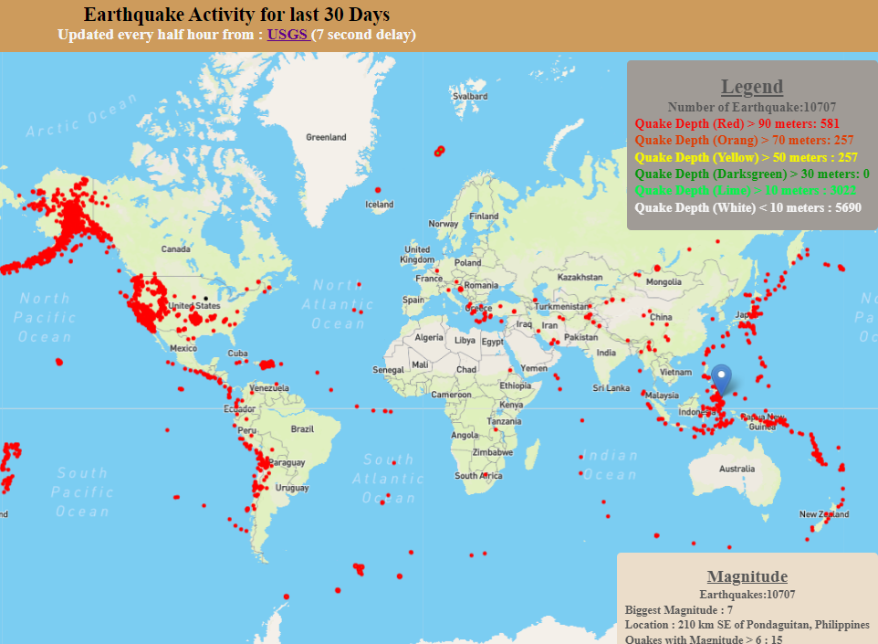

# Leaflet Homework - Visualizing Data with Leaflet

  

   

# Link to final solution:
  [Earthquake Webpage](https://phoogestraat.github.io/leaflet-challenge/)
  
  
  * For larger data sets (>10,000), loading time may take <u>up to 10 seconds</u>.
  
  * Depth of the earth corresponds to a range of colors form red (high depth) to white (low depth).
  
  * Radius of each circle increases with magnitude of earthquake.
  
  * A unique marker idenifies the earthquake with the largest magnitude.

  * Popups provide additional information about the earthquake when a marker is clicked.

## Background
The United States Geological Survey (USGS) is responsible for providing scientific data about natural hazards, the health of our ecosystems and environment; and the impacts of climate and land-use change. Their scientists develop new methods and tools to supply timely, relevant, and useful information about the Earth and its processes.  A visualization was created to track recent earthquakes and highlight relevant data for each earthquake. Data is updated every five minutes.

## Goal

### Visualization

1. **Data set**

   The USGS provides earthquake data in a number of different formats, updated every 5 minutes. Visit the [USGS GeoJSON Feed](http://earthquake.usgs.gov/earthquakes/feed/v1.0/geojson.php) page and pick a data set to visualize. When you click on a data set, for example 'All Earthquakes from the Past 7 Days', you will be given a JSON representation of that data. You will be using the URL of this JSON to pull in the data for our visualization.

2. **Import & Visualize the Data**

  Use a Leaflet map that plots all of the earthquakes from a data set based on their longitude and latitude.

   * Data markers reflect the magnitude of the earthquake by their size and and depth of the earth quake by color. Earthquakes with higher magnitudes should appear larger and earthquakes with greater depth should appear darker in color.

   

   * Popups provide additional information about the earthquake when a marker is clicked.

   * Legend provides context for map data.

   * Visualization resembles map above.

